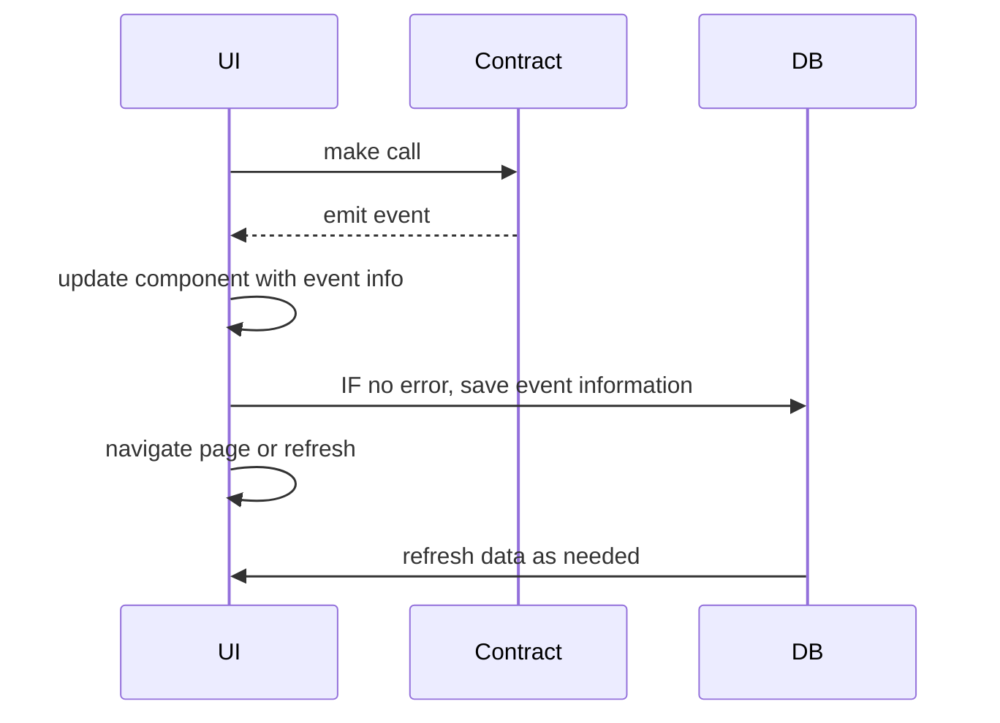

# Random Notes

## Tables
- BlockInfo (tracks last block, etc...) (indexer)
- Service (indexer)
- Exchange (indexer)
- ContactInfo (keyed by wallet address)

The majority of this info. should come from events, with the exception of "contact info".  Minimal need to write for a UI client.

That means you need a good event collector and the ability to sync the frontend with the indexed data. 

However, the majority of what we do now are demos.  So you don't want to persist the data over time - you need to start fresh for each demo.

- Using SQLite 'memory' works good for this.  But, you can't have 2 different processes accessing it.

Components:

- WebApp w/ GraphQL
- Database 
- Indexer
- ArLocal

What we're calling an 'indexer' listens to the chain and filters the events we're interested in, saving them in the database. 
The reality is, I don't think a proper indexer is needed right now.  An indexer is designed to keep state over time. We constantly refresh for demos.  In our case, we'd have to wipe the DB each time to keep things straight.  So I don't think there's any real value of having an indexer right now...it'd just make things a more complicated than needed. (YAGNI)

An interim solution:

**Make sure events mirror what we need in the DB** 

Flow: push events into the DB from the UI (vs. pulling). Pages always refresh from the DB

## TODO
- Update tables and interfaces
- Add SIWE, fake registry contract with default account addresses from Anvil

OR, is there a better approach in calling Solidity storage for accurate data:

// lookup all exchanges by service
mapping(serviceid => uint[] exchangeId) exchanges

// get exchanges by buyer
// get exchanges by seller 

// get services by owner
//... more ...

